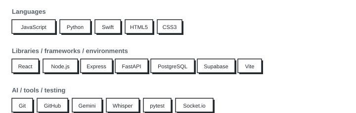

<picture>
  <source media="(prefers-color-scheme: dark)" srcset="./banner-dark.svg">
  <source media="(prefers-color-scheme: light)" srcset="./banner-light.svg">
  
</picture>

> *Always learning, always exploring.*

I'm a software engineer graduate from [Marcy Lab School](https://www.marcylabschool.org/) in Brooklyn, New York, where I've built full-stack web applications with the PERN stack. I care about writing clean, purposeful code — and I bring the same energy to engineering that I bring to everything else: all in.

When I'm not coding, you'll find me deep in a game, lost in a book, sketching ideas, or exploring the city I've called home my whole life.

---

### Featured projects

> 🟡 **[SubTrack NYC](https://github.com/NYC-Subtack-chat/NYC-Transit-App)** · In progress
>
> NYC transit app, built with a team
> 
> `Swift` `Node.js` `PostgreSQL/Supabase` `Socket.io` `MTA API`
>
> 
> 🟢 **[Compass](https://github.com/F-NAN-AI-ENGINEERING-RESIDENCY/compass)** · Complete
>
> Civic tech capstone — virtual classroom app, Product Lead
>
> `Python` `FastAPI` `PostgreSQL` `React` `WebSockets` `Gemini`
>
> 
> 🟢 **[WorkStarter](https://github.com/felixvargas7/full-stack-project-remix-felixvargas7/tree/feature/final-revisions)** · Complete
>
> PERN workout tracker — primary portfolio project
>
> `React` `Express` `PostgreSQL` `Node.js`
>
> 
> 🟢 **[MajFlix](https://github.com/felix-majeed-mls/mod-4-project)** · Complete
>
> TV/movie discovery app
>
> `JavaScript` `Vite` `TVMaze API`

<picture>
  <source media="(prefers-color-scheme: dark)" srcset="./tech-stack-dark.svg">
  <source media="(prefers-color-scheme: light)" srcset="./tech-stack-light.svg">
  
</picture>

---

## 📬 Let's connect

